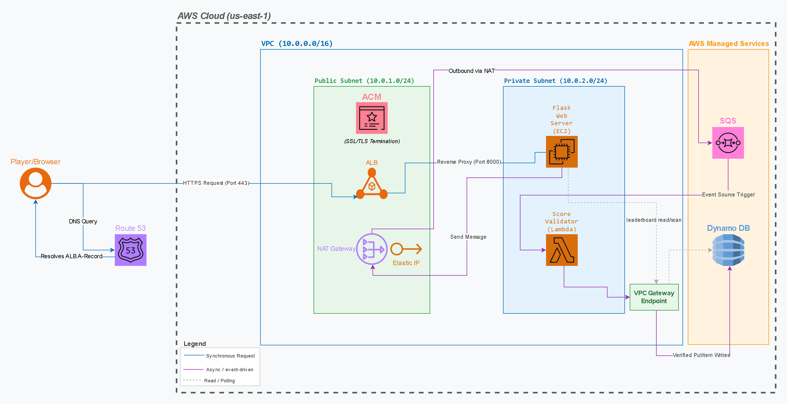

# ByteSized Arcade – Retro Web-Game Platform with Async High-Score Validation

A production-grade, cost-optimized, and secure AWS cloud architecture built for an indie gaming platform. This decoupled application uses an asynchronous message pipeline to gracefully absorb viral traffic surges, offload database writes, and automatically catch client-side cheating attempts before data persistence.

---

## 🏗️ Architecture Diagram

### 🔄 The End-to-End Data Flow
1. **The Client Edge:** Players connect securely via the public URL of an internet-facing **Application Load Balancer (ALB)**.
2. **The Web Tier:** The ALB balances HTTP web traffic across a farm of scalable **Amazon EC2 instances** running Nginx and a Python Flask backend application that serves the HTML5 arcade game.
3. **The Asynchronous Buffer:** When a session ends, the user's score payload is handed off to **Amazon SQS** via a secure `SendMessage` command rather than writing directly to the database.
4. **The Serverless Validator:** **AWS Lambda** polls the SQS queue, extracts payloads, and runs a backend physics verification model to drop invalid or fraudulent high scores.
5. **The Persistent State:** Sanitized payloads are written directly into **Amazon DynamoDB**. The EC2 instances query rankings through a completely free internal **VPC Gateway Endpoint** to serve a live leaderboard back to the UI.

---

## 🛠️ Tech Stack & Service Breakdown

* **Frontend UI:** Responsive HTML5 Canvas, JavaScript, and custom CSS styled for a retro arcade aesthetic.
* **Web Server / Compute:** **Amazon EC2 (`t3.micro`)** running Amazon Linux 2023, managed by Nginx as a reverse proxy and Gunicorn as the WSGI application server.
* **Decoupling / Ingest Queue:** **Amazon SQS (Standard)** acting as a highly resilient traffic shock absorber capable of infinite automatic ingestion scaling.
* **Serverless Compute Layer:** **AWS Lambda (Python 3.12)** executing pay-per-millisecond verification logic independent of web server resource availability.
* **Database Engine:** **Amazon DynamoDB (NoSQL)** running on-demand auto-scaling parameters to securely store score structures with absolute zero continuous idling costs.
* **Network Security:** Layered isolation boundaries consisting of an internal VPC layout, strict stateful **Security Groups**, and stateless **Network Access Control Lists (NACLs)**.

---

## 👥 Engineering Roles & Individual Contributions

### 👑 Michael — Project Lead & Architecture Designer
* Coordinated end-to-end milestone timelines and cross-functional team deliverables for the 2-week execution block.
* Designed the structural blueprint for the decoupled 3-tier matrix incorporating the AWS Well-Architected Framework.
* Managed standard project verification gates and established risk boundaries for credit cost protection.

### ⚙️ Ryan — Infrastructure Engineer
* Provisioned the custom `arcade-vpc` environment grid complete with isolated public and private multi-AZ subnets.
* Deployed private application-tier EC2 compute instances alongside internet-facing Application Load Balancers.
* Configured routing matrix configurations and verified target group health checks across the web tier.

### 🔌 Jorge — Integration & Automation Lead
* Architected the asynchronous event-driven interface bridging the Flask backend server to Amazon SQS.
* Wired the Amazon SQS event trigger architecture to wake and process incoming Lambda payloads seamlessly.
* Engineered the backend data pipeline ensuring smooth cross-service API requests and response transformations.

### 🛡️ Tonya — Security & IAM Lead
* Engineered the stateful security group firewalls isolating the database, application, and public routing components.
* Constructed AWS Identity & Access Management (IAM) role policies adhering to the strict Principle of Least Privilege.
* Hardened the internal server perimeter by applying restrictive Network ACL boundaries across subnet paths.

### 📝 Team Core (All Members) — Docs & Demo Leads
* Compiled technical verification criteria and captured proof-of-concept visual documentation.
* Designed the operational fallback live demonstration and prepared the cloud metrics dashboard slides.

---
